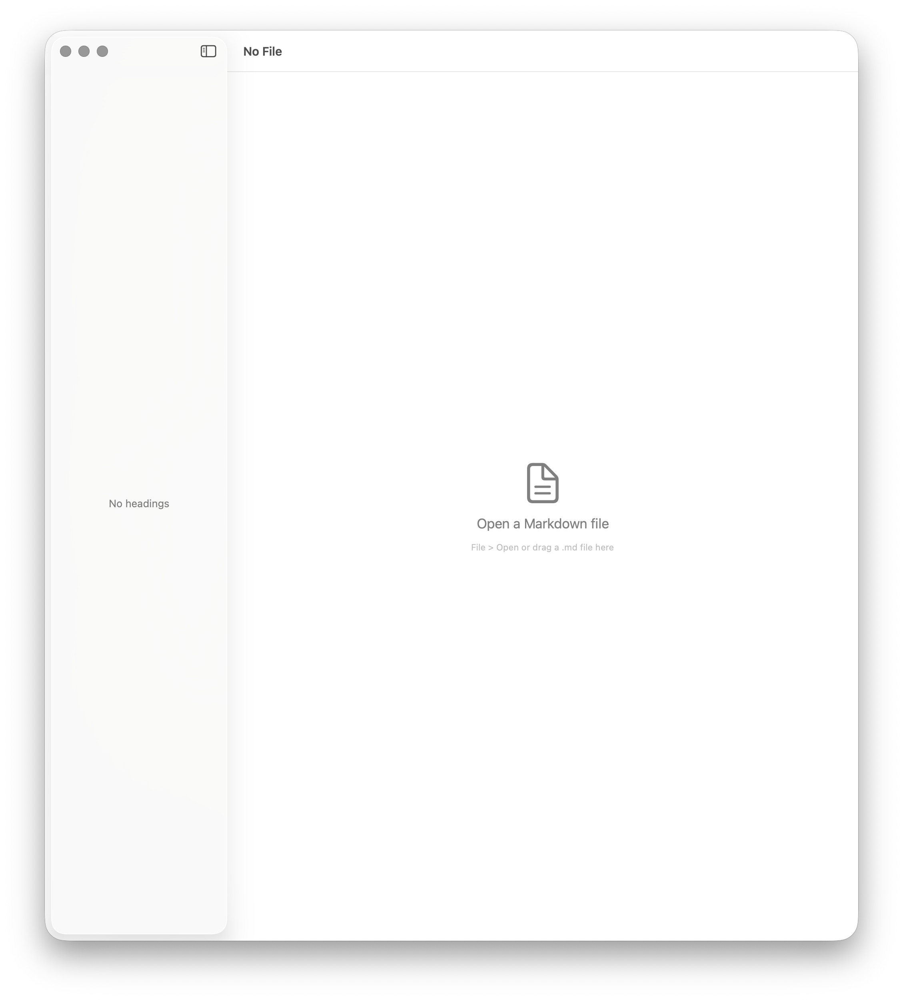
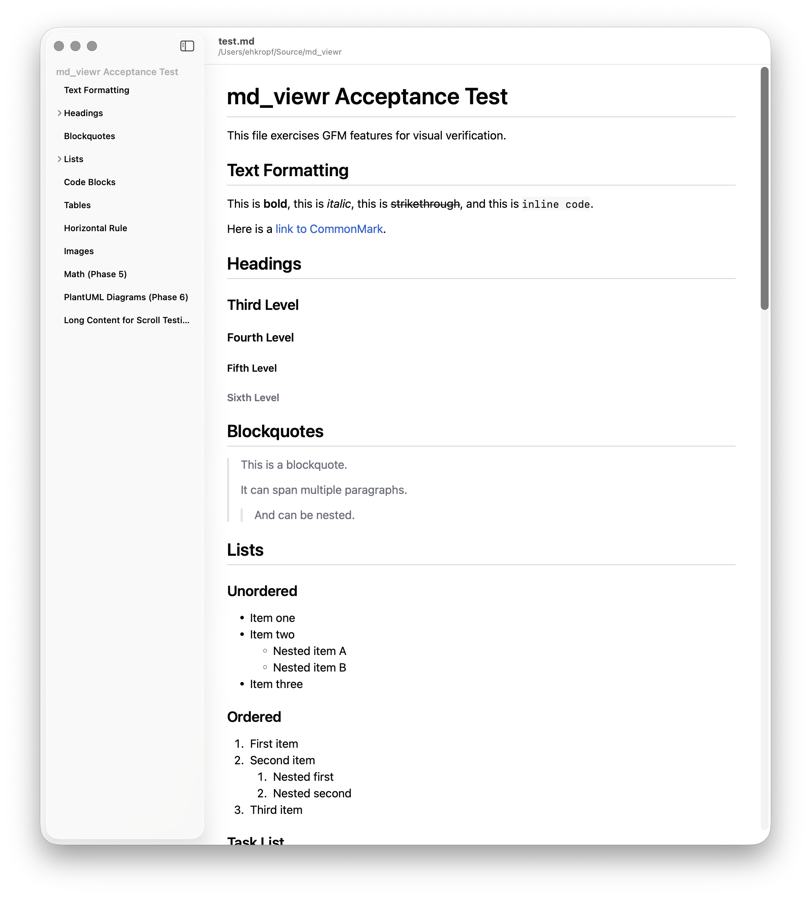

# md_viewr

A native macOS markdown viewer built with Swift and SwiftUI. No web views, no JavaScript — just fast, native rendering.

<p align="center">
  
  
</p>

## Features

- **GitHub Flavored Markdown** — full GFM spec: tables, task lists, strikethrough, fenced code blocks
- **Table of contents** — auto-generated sidebar from headings, click to scroll
- **Live reload** — watches the file for changes and re-renders instantly, keeping your scroll position
- **Syntax highlighting** — ~20 languages with regex-based tokenization
- **LaTeX math** — native rendering via SwiftMath (no MathJax/KaTeX)
- **PlantUML diagrams** — rendered via CLI subprocess as SVG
- **Multiple open methods** — File > Open, drag-and-drop, CLI argument, or registered `.md` file handler

## Requirements

- macOS 14 (Sonoma) or later
- Swift 6 toolchain
- [PlantUML](https://plantuml.com) (optional, for diagram rendering)
  ```
  sudo port install plantuml
  ```

## Build

```bash
# Build the .app bundle (release)
bash scripts/build-app.sh

# Debug build
bash scripts/build-app.sh debug

# Launch
open build/md_viewr.app
```

Or build and run directly with SPM:

```bash
swift build
.build/debug/md_viewr path/to/file.md
```

> **Note:** Running the bare executable (not the `.app` bundle) may cause window focus issues on macOS. Use the `.app` bundle for normal use.

## Install

Drag `build/md_viewr.app` to your Applications folder — just like any other Mac app.

Or from the command line:

```bash
cp -R build/md_viewr.app /Applications/
```

## Usage

```bash
# Open with a file
open build/md_viewr.app test.md

# Or run directly
build/md_viewr.app/Contents/MacOS/md_viewr ~/notes/readme.md
```

You can also:
- **Drag and drop** a `.md` file onto the window
- **File > Open** (⌘O) to browse for a file
- Double-click a `.md` file if md_viewr is set as the handler

## Architecture

```
md_viewr/
  App/           — entry point, AppDelegate, menu commands
  Models/        — MarkdownDocument, TOCEntry, FileWatcher
  Views/         — ContentView, TOCSidebarView, MathBlockView, DiagramBlockView
  Services/      — TOCExtractor, SyntaxHighlighter, PlantUMLRenderer
  Utilities/     — Slugify
```

Built entirely with Swift Package Manager — no Xcode project required.

### Dependencies

| Package | Purpose |
|---------|---------|
| [swift-markdown](https://github.com/swiftlang/swift-markdown) | GFM AST parsing |
| [swift-markdown-ui](https://github.com/gonzalezreal/swift-markdown-ui) | SwiftUI markdown rendering |
| [SwiftMath](https://github.com/mgriebling/SwiftMath) | LaTeX math rendering |

## License

GPL-3.0-or-later. See [LICENSE](LICENSE) for details.
