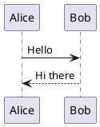

# md_viewr Acceptance Test

This file exercises GFM features for visual verification.

## Text Formatting

This is **bold**, this is *italic*, this is ~~strikethrough~~, and this is `inline code`.

Here is a [link to CommonMark](https://commonmark.org).

## Headings

### Third Level

#### Fourth Level

##### Fifth Level

###### Sixth Level

## Blockquotes

> This is a blockquote.
>
> It can span multiple paragraphs.
>
> > And can be nested.

## Lists

### Unordered

- Item one
- Item two
  - Nested item A
  - Nested item B
- Item three

### Ordered

1. First item
2. Second item
   1. Nested first
   2. Nested second
3. Third item

### Task List

- [x] Completed task
- [ ] Incomplete task
- [ ] Another incomplete task

## Code Blocks

```swift
func greet(name: String) -> String {
    return "Hello, \(name)!"
}
```

```python
def fibonacci(n):
    if n <= 1:
        return n
    return fibonacci(n - 1) + fibonacci(n - 2)
```

```json
{
  "name": "md_viewr",
  "version": "0.1.0",
  "platform": "macOS"
}
```

## Tables

| Feature | Status | Notes |
|---------|--------|-------|
| GFM rendering | Done | Core feature |
| TOC sidebar | Done | Sidebar navigation |
| File watching | Done | Live reload |
| Syntax highlighting | Done | ~20 languages |

## Horizontal Rule

---

## Images


## Math

```math
E = mc^2
```

```latex
\int_{0}^{\infty} e^{-x^2} dx = \frac{\sqrt{\pi}}{2}
```

### Dollar-Sign Syntax

$$
E = mc^2
$$

$$
\int_{0}^{\infty} e^{-x^2} dx = \frac{\sqrt{\pi}}{2}
$$

## PlantUML Diagrams



## Long Content for Scroll Testing

Lorem ipsum dolor sit amet, consectetur adipiscing elit. Sed do eiusmod tempor incididunt ut labore et dolore magna aliqua. Ut enim ad minim veniam, quis nostrud exercitation ullamco laboris nisi ut aliquip ex ea commodo consequat.

Duis aute irure dolor in reprehenderit in voluptate velit esse cillum dolore eu fugiat nulla pariatur. Excepteur sint occaecat cupidatat non proident, sunt in culpa qui officia deserunt mollit anim id est laborum.

Sed ut perspiciatis unde omnis iste natus error sit voluptatem accusantium doloremque laudantium, totam rem aperiam, eaque ipsa quae ab illo inventore veritatis et quasi architecto beatae vitae dicta sunt explicabo.

Nemo enim ipsam voluptatem quia voluptas sit aspernatur aut odit aut fugit, sed quia consequuntur magni dolores eos qui ratione voluptatem sequi nesciunt.

Neque porro quisquam est, qui dolorem ipsum quia dolor sit amet, consectetur, adipisci velit, sed quia non numquam eius modi tempora incidunt ut labore et dolore magnam aliquam quaerat voluptatem.
